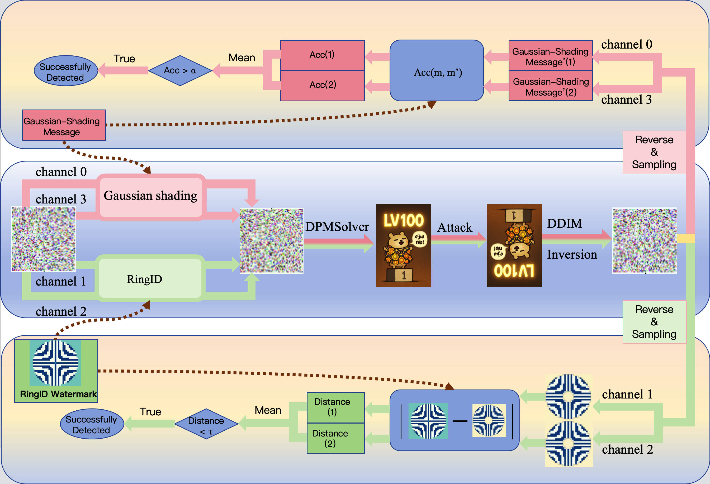
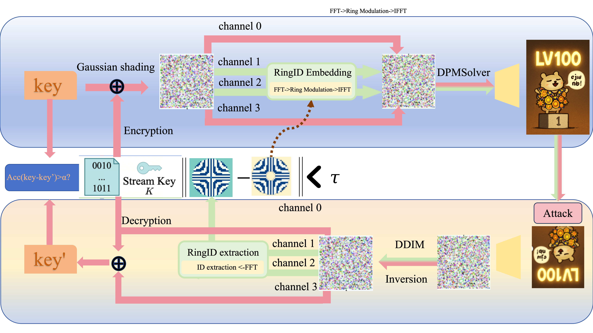

# Hybrid Watermark: Improving Tree-Ring Watermarking via RingID and Gaussian Shading

Tree-Ring/RingID excel at robustness to geometric transforms, while Gaussian Shading preserves latent statistics and avoids quality loss. Hybrid-Watermark fuses these strengths by embedding Gaussian Shading and RingID in different latent channels and combining their detection results.

## Method






### Improvements compared with Gaussian Shading
- Implement GS + RingID hybrid watermark in `watermark_hybrid.py`
  - As for function & variable naming, `rid` / `ring` denotes RingID related and `gs` denotes Gaussian Shading related. 
  - Refer to `rid_utils.py` for RingID watermark generation details. This file comes from RingID Repo with very mild modification.
  - `watermark.py` is the original Gaussian Shading implementation.
- Implement rotate distortion method in `image_utils.py`

## Getting Started

```
git clone https://github.com/lzliangzh/Hybrid-Watermark.git
cd Hybrid-Watermark
conda create -n hybrid_w python=3.9
conda activate hybrid_w
pip install -r requirements.txt
```

## Experiment

Refer to [scripts/experiment.sh](scripts/experiment.sh) for the main experiments.

Refer to the main program [run_gaussian_shading.py](run_gaussian_shading.py) for hyperparameters.

If you need configurable channels (GS/RingID) and auto-scaled RingID threshold, use [run_gaussian_shading_configurable.py](run_gaussian_shading_configurable.py):

```
python run_gaussian_shading_configurable.py \
      --gs_channels 0,2,3 \
      --ring_channels 1 \
      --num 100 \
      --brightness_factor 6
```

## Acknowledgements

- [Tree-Ring Watermarks: Fingerprints for Diffusion Images that are Invisible and Robust](https://github.com/YuxinWenRick/tree-ring-watermark)

- [RingID: Rethinking Tree-Ring Watermarking for Enhanced Multi-Key Identification](https://github.com/showlab/RingID)

- [Gaussian Shading: Provable Performance-Lossless Image Watermarking for Diffusion Models](https://github.com/bsmhmmlf/Gaussian-Shading)
